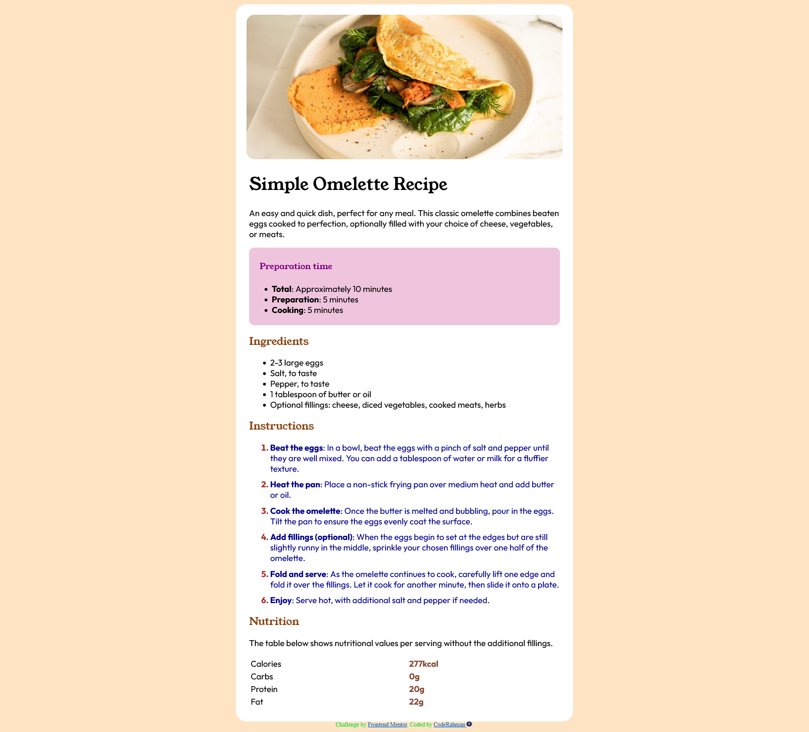

# Frontend Mentor - Recipe page solution

This is a solution to the [Recipe page challenge on Frontend Mentor](https://www.frontendmentor.io/challenges/recipe-page-KiTsR8QQKm). Frontend Mentor challenges help you improve your coding skills by building realistic projects. 

## Table of contents

- [Overview](#overview)
  - [Screenshot](#screenshot)
  - [Links](#links)
- [Author](#author)
- [Acknowledgments](#acknowledgments)

## Overview

### Screenshot

### Links

- Solution URL: https://github.com/CodeRahman/recipenew
- Live Site URL: https://coderahman.github.io/recipenew/

### Built with

- Semantic HTML5 markup
- CSS custom properties
- Flexbox

## Author

- Website - [Abdurrahman Oyediran](https://github.com/CodeRahman)
- Frontend Mentor - [@CodeRahman](https://www.frontendmentor.io/profile/CodeRahman)

## Acknowledgments

This is my first major project and I hope it only gets better from here on out.

